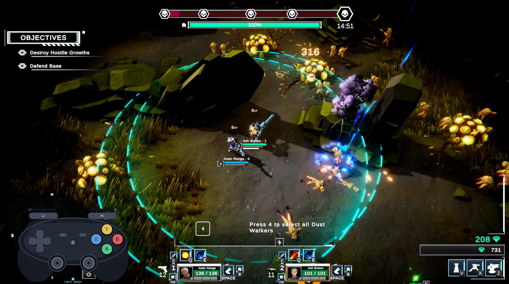

# Dust Walkers Controller Companion

Free, unofficial Steam Input controller support for **Dust Walkers**.

Dust Walkers Controller Companion was built around the way Dust Walkers actually plays rather than trying to force the game into a conventional twin-stick control scheme.

It uses a bounded right-stick cursor for normal combat and aiming, while holding LT temporarily enables unrestricted mouse control when the game needs full pointer movement.

## Project Website

The main project page is the current source of truth for setup, compatibility, gameplay clips, and release status:

**https://godofthunder101.github.io/dust-walkers-controller-companion/**

## Current Releases

### Demo v1

**Dust Walkers Controller Companion — Steam Input v1**

- Stable release for the finished Dust Walkers demo
- Fully validated through demo completion and follow-up play
- Steam App ID: `3904060`
- Layout ID: `3801908513`

Direct Steam configuration:

`steam://controllerconfig/3904060/3801908513`

### Playtest v1

**Dust Walkers Controller Companion — Playtest v1**

- Separate release for the current Dust Walkers playtest
- Fully validated through completion of the current playtest
- The published Community Layout itself was reapplied and used for a complete validation run
- Steam App ID: `3980470`
- Layout ID: `3802517026`

Direct Steam configuration:

`steam://controllerconfig/3980470/3802517026`

Playtest support is version-sensitive. Future Dust Walkers updates may change bindings, interface behaviour, or other assumptions used by the layout, so Playtest v1 may need to be retested or updated.

## Input-Mode Requirement

Both Controller Companion releases are designed exclusively for Dust Walkers' **WASD input mode**.

The alternative mouse / MOBA-style movement mode is not supported.

## Core Controller Design

- **Left Stick** — WASD movement
- **Right Stick** — bounded local cursor
- **Hold LT + Right Stick** — unrestricted mouse control
- **RT** — left click / confirm
- **R3** — teleport to base
- **Hold LT + R3** — right click / sell / target
- **D-pad** — abilities
- **Hold LT + D-pad** — Walker and squad selection
- **RB** — dodge
- **Face buttons** — interaction and construction
- **View** — inventory
- **Menu** — pause

The full controller map is available on the project website.

## Compatibility Note

Steam Input's Mouse Region behaved incorrectly at **175% Windows display scaling** during testing.

The bounded-cursor setup worked correctly at **100% Windows scaling**.

If the cursor appears offset or trapped in part of the screen, check Windows display scaling first.

## Steam Community Guide

A full Steam Community Guide is available for the Dust Walkers Playtest:

**https://steamcommunity.com/sharedfiles/filedetails/?id=3802577785**

It includes setup instructions, the complete mapping, compatibility information, and release details.

## Development Approach

The layout was developed friction-first:

1. Play normally until a specific control problem appears.
2. Solve that problem cleanly enough.
3. Test the change in real gameplay.
4. Keep it if it works.
5. Move on to the next friction point.

The goal was never to make Dust Walkers behave like a different game.

The goal was to reduce the control friction enough that the game itself became the thing being played rather than the input scheme.

## Repository Contents

This repository currently contains the source for the public Dust Walkers Controller Companion website hosted with GitHub Pages.

The actual controller layouts are distributed through Steam Community Layouts rather than as downloadable files from GitHub.

## Status

- Demo v1 — **Published / stable**
- Playtest v1 — **Published / validated for the current playtest build**
- Controller Glyph Overlay — **Planned optional future enhancement**

## Unofficial Community Project

Dust Walkers Controller Companion is a free, unofficial community project.

It is not affiliated with or endorsed by the Dust Walkers developers.

The developers have indicated that native controller support is something they hope to improve over time. Controller Companion is simply a community Steam Input option for players who want controller support in the meantime.

If native controller support eventually makes this project unnecessary, that is a good outcome.
